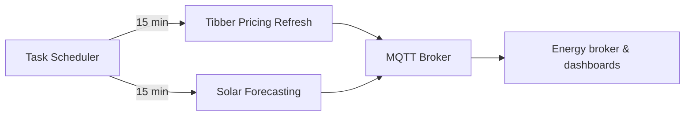

CerbomoticzGx
========================
## Introduction 
Do you have one or more of the following devices in your home?

- [x] Solar panels (the more the better)
- [x] A Tesla vehicle (optional)
- [x] A Tibber energy contract with a Pulse device (optional)
- [x] Victron Energy Equipment (Cerbo GX compatible Inverters/Chargers, MPPT charge controllers, etc.)
- [x] Home Energy Storage System with canbus or serial control and working well with your Victron system
- [x] an ABB B21/23/24 Kilowatt meter (optional)
- [x] a Domoticz based Home Automation system (optional)
- [x] HomeConnect enabled smart appliances (optional and currently requires you to run [https://github.com/hcpy2-0/hcpy](https://github.com/hcpy2-0/hcpy) as an additional service.) 

If so, this project might be something you will find interesting. Have a look at what this project offers by 
reading more below.  Also, many of the cool features the modules in this project offer are visualized and controllable 
via a by a frontend React based Dashboard which you can find over here: [venus-nextgen Energy Dashboard](https://github.com/JoshuaDodds/venus-nextgen)

## Features
This project is a series of modules which aim to integrate, automate and control the following systems and components.

- Victron Energy Equipment (Cerbo GX controlled Inverters, Solar MPPT charge controllers, etc.)
- Victron compatible LFP based Energy Storage Systems
- Tesla Electric Vehicles
- Tibber Smart Energy Supplier (hourly spot rate electricity supplier) API integration
- ABB B21/23/24 kWh meters
- Domoticz Home Automation System 


Current Features include:
- monitors a number of metrics from a Victron Energy CerboGX controlled system and reports these metrics back to
a Domoticz server via its REST API for monitoring and historic tracking
- Modular - Individual modules can be enabled or disabled in the ```.env``` file    
- Included a custom module which can be installed on a cerbo gx to read out ABB B2x kWh meters
- EV Charge Controller - Tesla vehicle charging at lowest rates or using only excess solar energy
- Grid Assisted vehicle charging mode for when you need to just charge at full rate regardless of cost
- Energy Broker module which attempts to buy energy at the lowest possible rate in a 48 hour period and store this in your home battery
- Tibber graphing module to generate visuals of the upcoming electricity prices (Thanks to [Tibberios](https://github.com/Lef-F/tibberios))
- Tibber API integration to constantly monitor current energy rates, daily consumption and production, forecasted pricing, etc (Thanks to [Tibber.py](https://github.com/BeatsuDev/tibber.py))
- deep integration with Victron system for monitoring and control via the cerbo Gx MQTT broker
- Creates, exports, and updates a number of custom metrics to the victron MQTT broker for consumption by the [venus-nextgen Energy Dashboard](https://github.com/JoshuaDodds/venus-nextgen)
- dynamic ESS algorithms for automated buy and sell of energy
- solar forecasting data specific to your installation using ML models and AI for quite accurate current day production forecasts (courtesy of new VRM API features developed by Victron Energy). Note: A Victron VRM portal account is needed for this feature.
- HomeConnect supported appliance control. Schedules appliances to run at cheapest time of day without user intervention

Configuration for your CerboGX IP Address, VRM instance ID, and Domoticz IP/Port are configured in 
the ```.env``` configuration file. 

Note: The name of this project is a nod to both Victron Energy & the Domoticz project.


### Installation
```pip install -r requirements.txt```

### Configuration / Setup
- Read the ```.env-example``` file carefully and adjust as needed. Rename to ```.env```
- Do the same for ```.secrets-example``` and rename to ```.secrets```
- If you rely on Tibber live measurements, set `HOME_ID` in `.secrets` to the home that has real-time data enabled.
- If Tibber live measurements report that real-time consumption is disabled even though the developer portal works,
  set `TIBBER_LIVE_MEASUREMENTS_FORCE=1` in `.env` to attempt a direct websocket subscription.
- Carefully read through lib/contstants.py and adjust to fit your situation. Most logic is event driven and events topics that drive logic are
  defined here in this file
- Homeconnect support is defined in constants as well but requires an external service to publish state. (see hcpy project mentioned in the introduction of this doc)
- Configure the nightly charging skip guardrails if desired: `NIGHT_CHARGE_SKIP_ENABLED` toggles the behaviour and `NIGHT_CHARGE_SKIP_MIN_SOC` / `NIGHT_CHARGE_SKIP_MAX_SOC` bound the state-of-charge window that will skip the 21:30 schedule run.
- IMPORTANT:  See notes below if you plan to run this from a container image.  My image won't work for you as is. Read the notes below
for the things you will need to adjust in your own fork of this repo.
 
**TODO: handle this issue automatically in a universal container build** 

### Architecture Overview


### Operations
- Tibber pricing data refreshes at :01, :16, :31, and :46 each hour to keep spot pricing current.
- Solar forecasting runs every 15 minutes alongside pricing refreshes.


### Running from CLI
```python3 main.py```

### Docker Container
If you will be building and running this from a container you will want to fork this repo and make sure you set up your configuration 
to match your wishes and your own system.

Check the entrypoint.sh  for the container. You will need to adjust how you handle secrets & gitops configuration injection for the container.

Finally, use the build.sh script as a template for building an arm64 image and pushing it to a container repository.

---------------
(This package is in its infancy, but contributions and collaborations are welcome.)

Copyright 2022, 2023, 2024, 2025 Joshua Dodds - All Rights Reserved.
